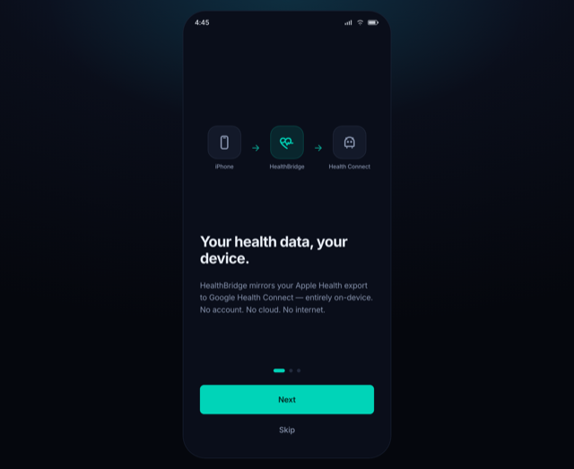
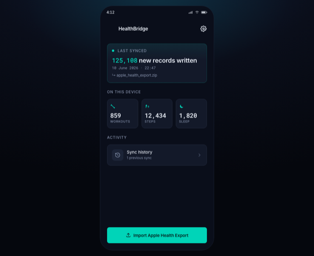
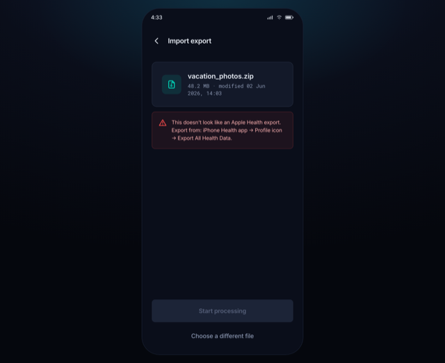
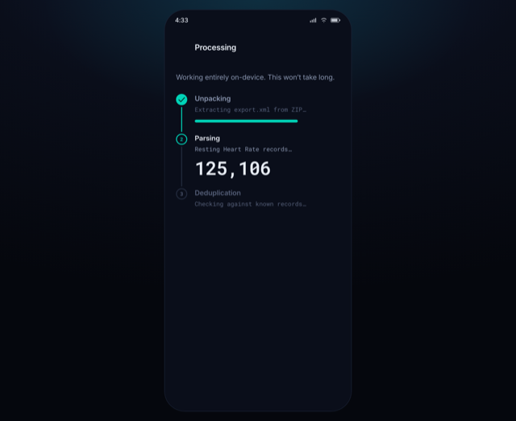
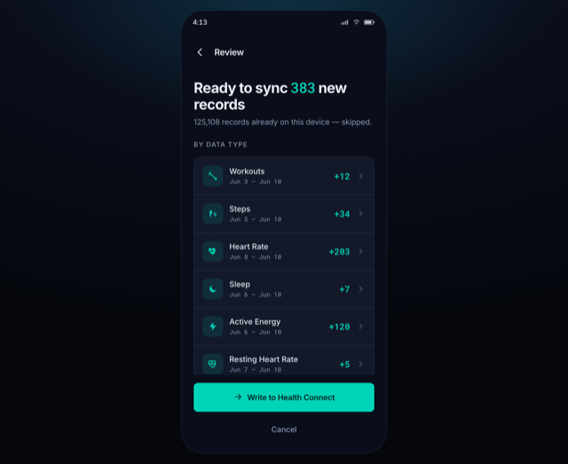
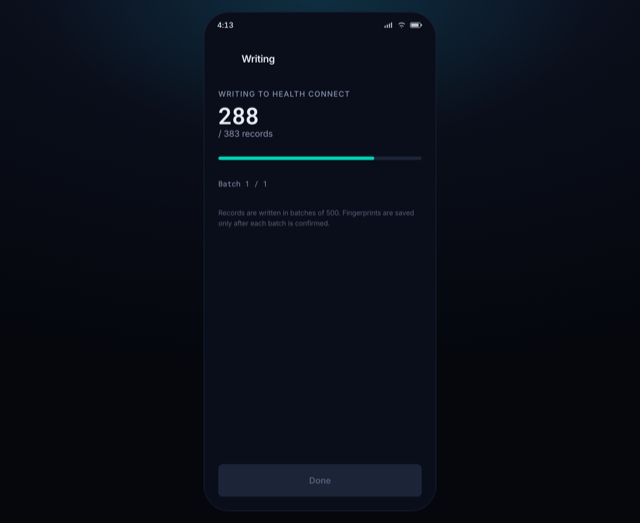
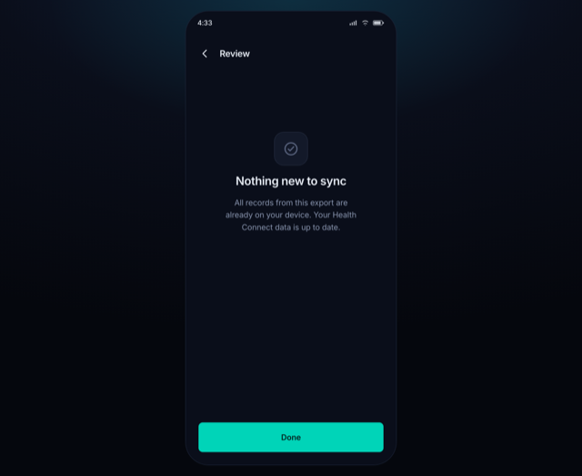
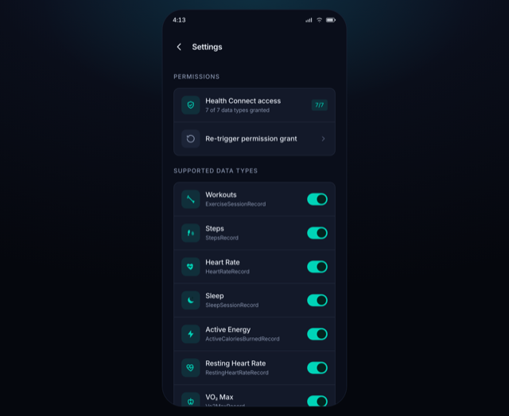

<div align="center">


# HealthBridge

**Mirror your Apple Health data to Google Health Connect — on-device, no account, no cloud.**

`Android` · `Kotlin / Jetpack Compose` · `Health Connect` · `100% offline`

[**▶ Try the live prototype**](https://justanotheraryan-code.github.io/health-sync/) &nbsp;·&nbsp; [Web prototype](web-prototype/) &nbsp;·&nbsp; [Android scaffold](healthbridge-android/) &nbsp;·&nbsp; [PRD](healthbridge-prd.md)

</div>

---

## What it is

If you record workouts on an iPhone/Apple Watch but live on Android, your health history is
stranded. **HealthBridge** closes that gap without a subscription or a cloud middleman:

1. On your iPhone, export your data (**Health app → Profile → Export All Health Data** → a `.zip`).
2. Transfer the `.zip` to your Android phone.
3. HealthBridge parses it, **deduplicates** against a local fingerprint database, and writes
   **only the new records** to Google Health Connect — from where Google Fit, Garmin Connect,
   and any Health-Connect-aware app can read them.

No backend. No accounts. No internet permission. Everything runs on the device.

---

## This repository contains two things

| | What | Status |
|---|---|---|
| 🟢 **[`web-prototype/`](web-prototype/)** | A fully interactive, installable **PWA** of all 8 screens. Real flow, real dedup logic, runs in any browser. | **Done & testable now** |
| 🧱 **[`healthbridge-android/`](healthbridge-android/)** | The native **Kotlin / Jetpack Compose** project — theme, navigation, Compose screens, parser, Room fingerprint DB, Health Connect, sync pipeline. | **Architecture scaffold** (UI + structure in place; engine internals marked `TODO`) |

The prototype is the **design + interaction source of truth**; the Android module is the real
codebase, scaffolded to match it screen-for-screen.

---

## Screens

| Onboarding | Home | Import — validation |
|---|---|---|
|  |  |  |

| Processing | **Delta Review** | Writing |
|---|---|---|
|  |  |  |

| Nothing-new (dedup) | Settings |
|---|---|
|  |  |

---

## Try it in 30 seconds

### Online (easiest)
Open **https://justanotheraryan-code.github.io/health-sync/** on your phone, then **Add to Home
Screen** — it installs as a standalone app and runs offline.

### Locally
```bash
git clone https://github.com/justanotheraryan-code/health-sync.git
cd health-sync/web-prototype
open index.html      # macOS — or just double-click it / drag into a browser
```

### Feel the core value (deduplication)
1. **Import Apple Health Export** → choose `apple_health_export.zip` → **Start processing** →
   watch the 3-stage pipeline → **Write to Health Connect**. That's a first full sync (~125k records).
2. Import the **same** file again → *"Nothing new to sync."* — every record is recognized as already-synced.
3. Import `export_2026-06-10.zip` (a newer export) → a **partial delta** of 383 new records; the rest skipped.
4. `vacation_photos.zip` → an inline **validation error** (it's not a Health export).

> The dedup is real, not scripted: a per-type fingerprint count is kept and
> `delta = fileTotal − alreadySynced` is computed on every import — the same logic the Room
> fingerprint DB uses on-device.

---

## Design language

Faithful to the PRD's tokens — a precision instrument, not a wellness app:

- **Color** — deep navy → near-black surfaces with a single electric-teal accent `#00D4B8`
- **Type** — monospace for every data value; sans (Inter) for labels
- **No shadows** anywhere — elevation is expressed purely through surface-color steps
- **Radii** 12 / 8 / 4 dp · **4-dp spacing grid** · shared-axis screen transitions

Tokens live in [`web-prototype/styles.css`](web-prototype/styles.css) (`:root`) and
[`healthbridge-android/.../ui/theme/Color.kt`](healthbridge-android/app/src/main/java/com/healthbridge/ui/theme/) — kept identical.

---

## The on-device pipeline

```
.zip ─▶ ZipExtractor ─▶ XmlStreamParser ─▶ FingerprintEngine ─▶ DataTypeFilter
                         (SAX, streaming)   (SHA-256 dedup)      (toggles + unsupported)
        ─▶ HealthConnectMapper ─▶ HealthConnectWriter ─▶ SyncLogger
           (Apple → HC records)   (batches of 500)        (Room sync_log)
```

**Supported data types (MVP):** Workouts · Steps · Heart Rate · Sleep · Active Energy ·
Resting Heart Rate · VO₂ Max.

**Fingerprint** = SHA-256 of `type + startDate + endDate + sourceName` (values/calories are
deliberately excluded, so later edits don't create duplicates). A fingerprint is stored **only
after** Health Connect confirms the batch write.

---

## Building the Android app

> The scaffold compiles into a real project structure; business-logic internals are marked
> `// TODO`. To produce an installable **APK/AAB**:

```bash
# Requires Android Studio (Hedgehog+) or the Android SDK + a JDK 17
cd healthbridge-android
# generate the Gradle wrapper jar once (not committed):
gradle wrapper --gradle-version 8.2
./gradlew assembleDebug        # → app/build/outputs/apk/debug/app-debug.apk
# then: adb install -r app/build/outputs/apk/debug/app-debug.apk
```

Open `healthbridge-android/` directly in Android Studio to run on a device/emulator with
Health Connect installed. See [`healthbridge-android/README.md`](healthbridge-android/README.md).

---

## Project structure

```
health-sync/
├── web-prototype/            # interactive PWA — the testable v1
│   ├── index.html  styles.css
│   ├── data.js               # mock Apple Health export + dedup/state engine
│   ├── app.js  screens.js  icons.js
│   ├── manifest.webmanifest  sw.js  icons/
│   └── selftest.html         # headless end-to-end flow assertion
├── healthbridge-android/     # native Kotlin/Compose scaffold
│   └── app/src/main/java/com/healthbridge/{ui,parser,fingerprint,healthconnect,sync}
├── docs/screenshots/
├── healthbridge-prd.md       # the product spec this is built from
└── index.html                # redirect → web-prototype/ (for GitHub Pages)
```

---

## Privacy & security

- **No `INTERNET` permission** is declared — the app physically cannot phone home.
- No analytics, no crash SDKs, no telemetry.
- The fingerprint database stores only **hashes of type + date** — never your health values.
- Extracted XML lives in `cacheDir` and is deleted immediately after parsing.

---

## Roadmap

- **MVP** — all 8 screens, the 7 data types above, manual import, fingerprint dedup, sync log, settings.
- **v1.1** — GPS routes (`WorkoutRoute` → `ExerciseRoute`), in-workout HR intervals, CSV log export.
- **v2.0** — watch-a-folder auto-import prompts, more data types (SpO₂, BP, weight, body-fat),
  Garmin/Fitbit export parsers on the same dedup + write pipeline.

---

<div align="center">
Built from <a href="healthbridge-prd.md">the HealthBridge PRD</a>. Open source · no accounts · no analytics · on-device.
</div>
